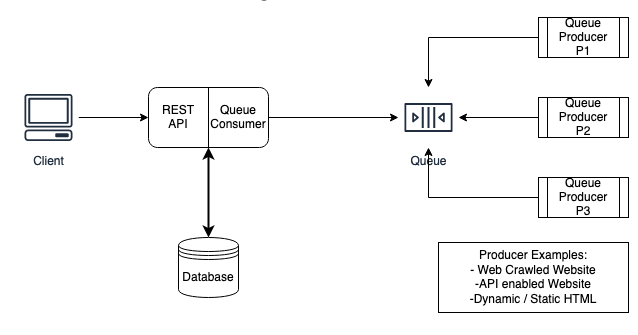

# Copenhagen BioHackathon2020 - Team BioCrawCraw

This is the home repository of team BioCrawCraw's contributions in Copenhagen BioHackathon 2020.

Web Scraper initial design:
===============
___

___

The Components listed above are:

Queue Producers:
---------------

  These should be maintained under the `crawler_templates` directory. They supply, or produce study data that is parsed
  or crawled from external sites
   
Queue:
------
 
   We currently use aws SQS for storing messages in a cost effective way
   
Queue Consumer:
---------------
 
   This component is scheduled to be built with the intent to consume messages that are delivered
   to the queue. This component will process the messages and store them in the database. Will will use
   a cost effective database initlally for storing messages.
   
REST API:
---------

  This component is scheduled to be built where by studies stored in the database can be queried
  based on study attribute (i.e. author, publish date, keyword)